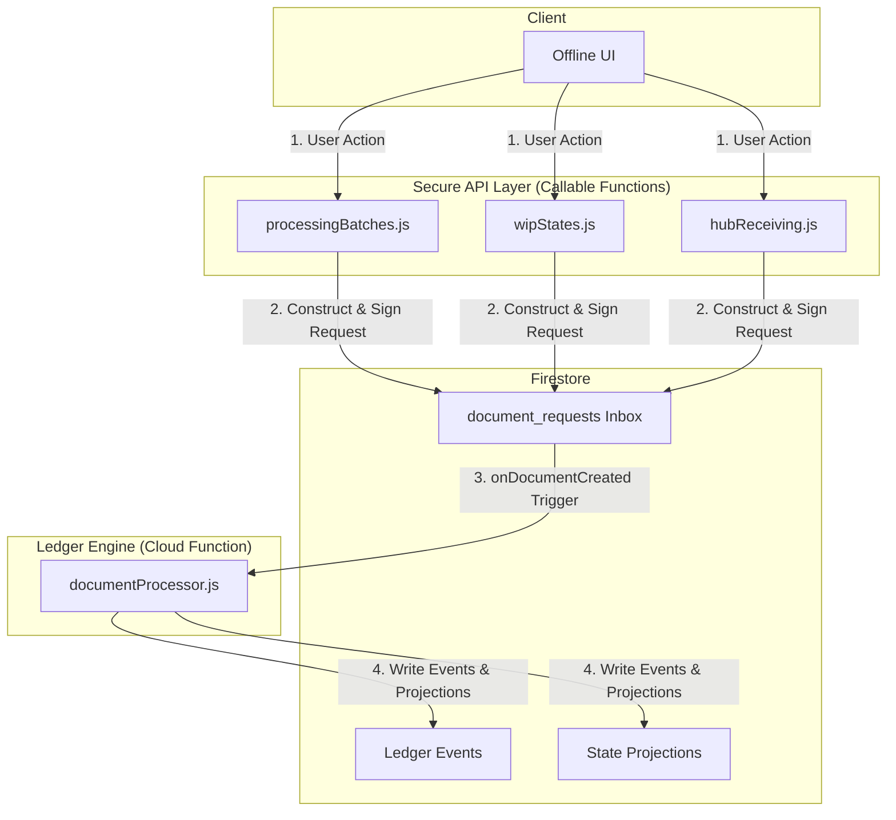

## OPS3 Backend Architecture

**VERDICT: FROZEN**

This document describes the final, verified, and frozen backend architecture for OPS3 as of the Phase 2 Foundation Freeze. The system is designed as a layered, event-driven architecture with a strong emphasis on financial integrity, offline-first capability, and security.

### 1. Core Principles

- **Ledger as the Single Source of Truth:** All financial and inventory state changes are derived from an immutable, append-only ledger of events. State documents (`wallet_states`, `inventory_states`) are merely projections of this ledger.
- **Idempotent & Atomic Transactions:** Every state-changing operation is wrapped in an idempotency lock and executed within a single Firestore transaction to guarantee atomicity and prevent duplicate processing.
- **Secure by Default:** All client-side writes are blocked by default. All operations must pass through secure, role-checked, and scope-enforced callable Cloud Functions.
- **Layered Abstraction:** The system is divided into distinct layers, each with a specific responsibility, from the core ledger engine to higher-level operational control modules.

### 2. Architectural Layers

#### Layer 1: The Ledger Engine (`documentProcessor.js`)

This is the heart of the system. It is a single, powerful Cloud Function (`validateDocumentRequest`) triggered by new documents in the `document_requests` collection. Its sole responsibility is to translate a validated request into immutable ledger events.

- **Responsibilities:**
    - HMAC signature validation
    - Idempotency locking
    - Firestore transaction management
    - Negative inventory and financial validation
    - Writing `wallet_events` and `inventory_events`
    - Updating state projections (`wallet_states`, `inventory_states`)
- **Key Invariant:** This is the *only* part of the system that can write to the core ledger and state collections.

#### Layer 2: Operational Control Modules (Callable Functions)

These modules provide the business logic for specific factory and hub operations. They act as a secure API layer, validating user input and constructing the correct `document_request` payload to be sent to the Ledger Engine.

- **Modules:**
    - **`processingBatches.js`**: Manages the lifecycle of factory processing batches (`draft`, `in_progress`, `completed`).
    - **`wipStates.js`**: Manages the state of inventory as it moves through Work-In-Progress stages.
    - **`hubReceiving.js`**: Manages the process of receiving catch from boats at the central hub.
- **Responsibilities:**
    - Enforce business rules and state transitions (e.g., a batch cannot be completed without a transformation document).
    - Authenticate and authorize user actions based on roles and scope.
    - Construct and sign valid `document_request` payloads.
- **Key Invariant:** These modules *never* write directly to the ledger or state collections. They only post requests to the `document_requests` inbox.

#### Layer 3: Offline Request Inbox (`document_requests`)

This Firestore collection serves as the secure, asynchronous inbox for all state-changing requests. Offline-first clients write their signed requests to this collection. The `validateDocumentRequest` function processes them as they arrive.

- **Responsibilities:**
    - Decouple client requests from backend processing.
    - Enable offline clients to queue operations.
- **Key Invariant:** All documents in this collection are HMAC-signed by the client, ensuring they have not been tampered with.

### 3. Data Flow Diagram

### 4. Conclusion

The OPS3 backend architecture is a robust, secure, and scalable system designed for high-integrity financial and inventory management. The clear separation of layers and the central role of the immutable ledger provide a strong foundation for future development.
